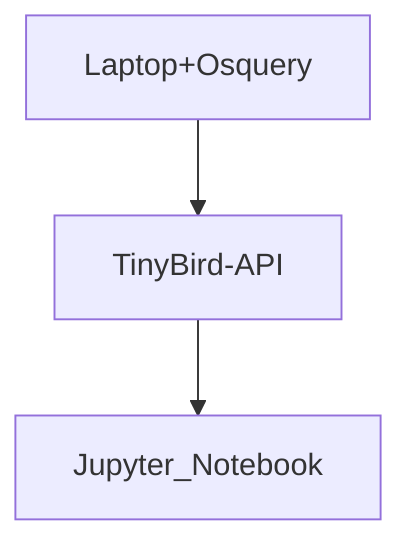

# Monitoring Devices Using Osquery and TinyBird

This repository demonstrates how to capture osquery events using TinyBird's REST endpoint. Osquery provides a simple way for users to capture OS level events and send them to be processes and monitored. In this use case, we will be monitoring processes running on a computer. Osquery can be deployed on many devices enabling you to monitor all the machines in your enterprise.

The diagram below shows the simple flow of osquery events. The destination will be a jupyter notebook where a DS can begin to do analytics.



We will be using python in this example. Create a virtual environment using the commands below.

```bash
python -m venv env
source env/bin/activate
```
This will create an `env` directory and activate it. Next install the required python modules.

```bash
pip install -r requirements.txt
```

## TB CLI

The commands in the previous section will also install the TinyBird CLI `tb`. After configuring the CLI with authorization, run the command below to deploy the TinyBird components already defined in this project.

```bash
tb push
```

# Running Osquery on your Machine
On a MACOS, you can install osquery using brew. For linux and windows, you can go to the osquery [docs](https://osquery.readthedocs.io/en/stable/).

```bash
brew install --cask osquery
```

## Create a .env file
This osquery [extension](./tinybird.ext) defines the query to run by the osquery daemon and how to forward it to TinyBird's REST endpoint. You will need a TinyBird security token and the name of the data source being created. Place the token in the .env file as well as the data source name. 

```properties
DS=osquery_processes_tb
TOKEN=
```

Run the command below to begin. The data source will automatically get created in TinyBird from which you can start building pipelines.

```bash
osqueryd \
  --extension tinybird.ext \
  --logger_plugin=tb_logger  \
  --config_plugin=osquery_config \
  --allow_unsafe \
  --disable_events=false
```

# Jupyter Notebook
We will visualize the data in a jupyter notebook. Run the notebook using the command

```bash
jupyter notebook
```

This command will open up a browser tab and display the jupyter notebook. Proceed to the `jupyter` folder and open the .ipynb file.

Run each cell in order using `command + return`. The last cell will display the contents top processes reading or writing data.

# Alternative SQL
This will find the processes communicating with an external address.

```sql
select name, remote_address, count(*) cnt  
from processes p 
join process_open_sockets s on s.pid=p.pid 
group by name, remote_address;
```

# OpenAPI
Generate a client using the openapi-generator.

```
brew install openapi-generator

openapi-generator generate \
    -i $URL_TO_OPENAPI_YAML \
    -g python  \
    -o ./tmp/test/ \
    --skip-validate-spec \
    --enable-post-process-file

```